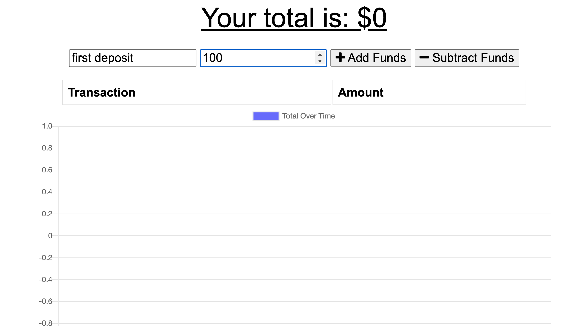
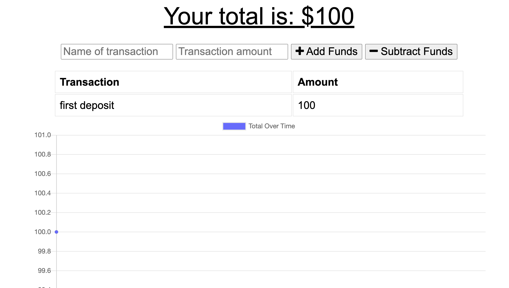
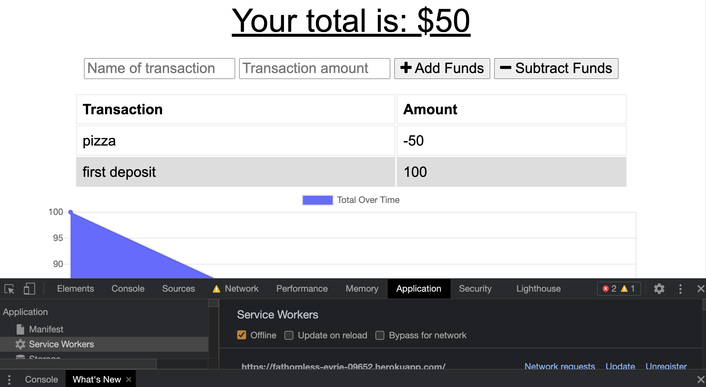
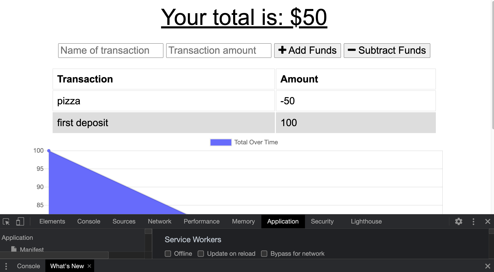

# BudgetTracker

# Employee Directory

  

  ## Table of contents
  - [Description](#description)
  - [Installation](#installation)
  - [Usage](#usage)
  - [License](#license)
  - [Contributors](#contributors)
  - [Tests](#tests)
  - [Deployed Site](#deployed-site)
  - [Questions](#questions)

  ## Description
  App for tracking your budget on and offline.

  ## Installation
  no install required. you can checkout the deployed site on heroku listed below

  
  
  
  
   
  

  ## Usage
  * follow link to deployed application
  * put info in name of transaction and put an amount in transaction amount
  * click add or subtract funds
  * right click, go to inspect, applications tab
  * once in applications tab click on the service worker gear on the left
  * click in the offline checkbox
  * do another transaction
  * uncheck the offline checkbox and refresh
  * you should see an up to date budget

  ## License
  

  The license covering this application is the MIT license.

  ## Contributors
  I am the sole contributor

  ## Tests
  There are no tests included

  ## Deployed Site
  You can visit the site using <a href="https://fathomless-eyrie-09652.herokuapp.com/">Heroku</a>

  ## Questions
  Find me on Github or reach out via email

  You can find me on GitHub at [iigonzoii](https://github.com/iigonzoii)

  Email me if you run into any questions at a.gonzalez418@gmail.com
 